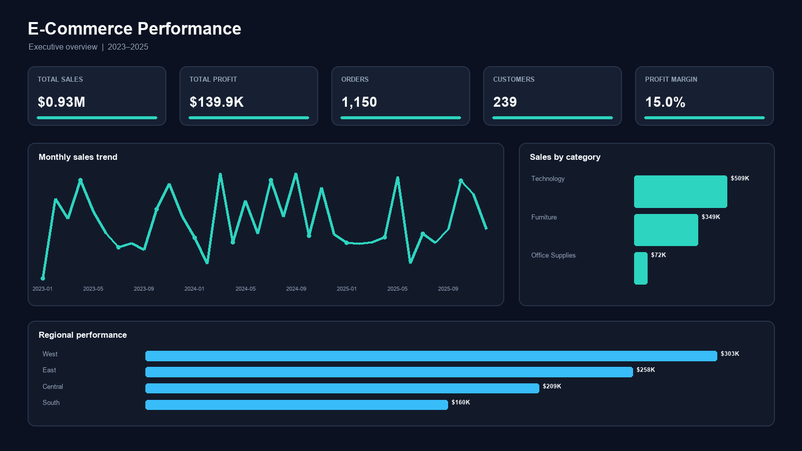
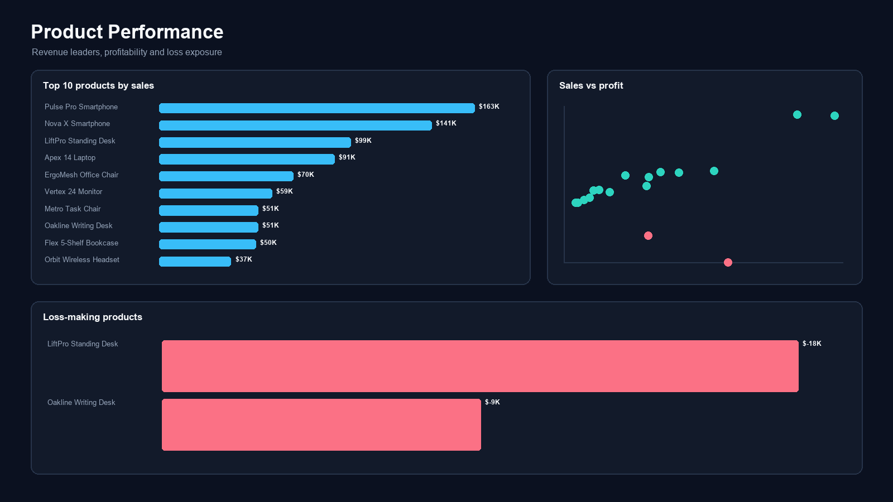
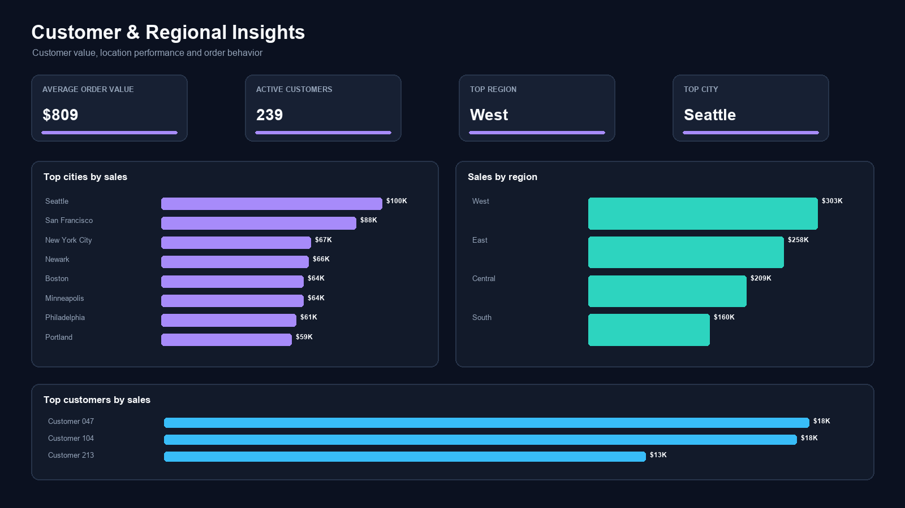

# E-Commerce Sales & Profit Analytics Dashboard

An interactive three-page Power BI portfolio project for analyzing revenue, profitability, product performance, customer behavior, and regional trends. The project uses Power Query for data preparation, a star-schema date model, and DAX measures for business KPIs.

> The included images are design previews generated from the supplied dataset. Replace them with screenshots from the final PBIX before publishing the repository.

## Dashboard preview

### Executive overview



### Product analysis



### Customer and regional analysis



## Business questions

- What are total sales, total profit, and profit margin?
- Which categories and products generate the most revenue?
- Which products are loss-making?
- How do sales change by month?
- Which regions and cities perform best?
- What is the average order value?
- Who are the highest-value customers?

## Dataset

The repository includes a reproducible synthetic e-commerce dataset suitable for portfolio use. It contains 1,953 order lines, 1,150 orders, 239 customers, and activity from January 2023 through December 2025.

Main fields include order and ship dates, customer, segment, region, city, category, sub-category, product, quantity, discount, sales, profit, and shipping cost.

## Tools and methods

- Power BI Desktop
- Power Query for type conversion, blank-row removal, and duplicate checks
- DAX for KPIs, time intelligence, rankings, and loss analysis
- Data modeling with a dedicated Date table
- Interactive slicers, cross-filtering, Top N filters, bookmarks, and conditional formatting

## Data preparation

1. Imported the UTF-8 CSV and promoted the first row as headers.
2. Assigned date, whole-number, percentage, currency, and text data types.
3. Removed blank order records and duplicate row identifiers.
4. Created a Date table and a one-to-many relationship to `Sales[Order Date]`.
5. Added sort columns for Month and Month Year.

The reusable Power Query script is available in [`power-query/Sales Query.m`](power-query/Sales%20Query.m).

## Core DAX measures

```DAX
Total Sales = SUM ( Sales[Sales] )

Total Profit = SUM ( Sales[Profit] )

Total Orders = DISTINCTCOUNT ( Sales[Order ID] )

Total Customers = DISTINCTCOUNT ( Sales[Customer ID] )

Profit Margin = DIVIDE ( [Total Profit], [Total Sales], 0 )

Average Order Value = DIVIDE ( [Total Sales], [Total Orders], 0 )
```

Additional time-intelligence, ranking, and loss measures are in [`measures/Ecommerce Measures.dax`](measures/Ecommerce%20Measures.dax).

## Dashboard pages

1. **Executive Overview** — KPI cards, monthly sales trend, category sales, and regional performance.
2. **Product Analysis** — Top 10 products, category/sub-category matrix, sales-versus-profit scatter plot, and loss-making product table.
3. **Customer & Regional Analysis** — Average order value, customer ranking, city and region performance, order behavior, and interactive slicers.

## Key insights

- Total sales reached **$930,546**, with **$139,906** in profit and a **15.0%** profit margin.
- Average order value was **$809** across **1,150** orders.
- **Technology** generated the most sales.
- **West** was the strongest region, and **Seattle** was the leading city by sales.
- **Pulse Pro Smartphone** was the highest-selling product.
- **LiftPro Standing Desk** and **Oakline Writing Desk** produced aggregate losses, showing the effect of high product cost, discounting, and shipping expense.

## Repository structure

```text
power-bi-ecommerce-sales-dashboard/
├── README.md
├── BUILD-GUIDE.md
├── Ecommerce-Sales-Dashboard.pbix   # add after building in Power BI Desktop
├── dataset/
│   └── ecommerce-sales.csv
├── measures/
│   ├── Date Table.dax
│   └── Ecommerce Measures.dax
├── power-query/
│   └── Sales Query.m
├── screenshots/
│   ├── executive-overview.png
│   ├── product-analysis.png
│   └── regional-analysis.png
├── theme/
│   └── ecommerce-dark-theme.json
└── LICENSE
```

## Build the PBIX

Follow [`BUILD-GUIDE.md`](BUILD-GUIDE.md), save the report as `Ecommerce-Sales-Dashboard.pbix` in the repository root, and replace the preview images with screenshots exported from Power BI. The baseline totals in `project-summary.json` can be used to validate the report.

## Author

**Abdul Wahab**  
Power BI Data Visualization portfolio project

## License

This project is available under the [MIT License](LICENSE).
